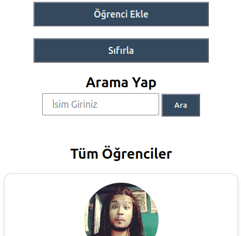

# TR
# Öğrenci Otomasyonu
localStorage tabanlı, tarayıcıda çalışan sade bir öğrenci yönetim uygulaması. Öğrenci ekleme, silme, güncelleme ve ada göre arama işlemlerini destekler; sayfa yenilendiğinde veriler kaybolmaz.

## Canlı Önizleme

[Proje önizlemesi.](https://dursunkokturk.github.io/JavaScript-Project-Student-Automation/)

## Özellikler

- Öğrenci Listeleme — 20 başlangıç öğrencisi localStorage'a yazılır ve kart formatında listelenir
- Öğrenci Ekleme — prompt() ile ad, soyad, yaş, cinsiyet ve fotoğraf URL alınarak listeye eklenir
- Öğrenci Silme — Onay kutusuyla birlikte seçilen öğrenciyi listeden ve localStorage'dan kaldırır
- Öğrenci Güncelleme — Seçilen öğrencinin tüm bilgilerini prompt() üzerinden günceller
- Ada Göre Arama — Form gönderimi ile büyük/küçük harf duyarsız, anlık filtreleme yapar
- Sıfırlama — Arama kutusunu temizler ve tam listeyi yeniden gösterir
- localStorage Kalıcılığı — Sayfa yenilendiğinde veriler korunur; ilk açılışta başlangıç verisi otomatik yazılır
- Duyarlı Kart Tasarımı — Mobilsde tek sütun, tablette iki sütun, masaüstünde üç sütun

## Duyarlı Düzenler

| Ekran    | Genişlik         | Düzen                                       |
| -------- |------------------| --------------------------------------------|
| Mobil    | 375px Varsayılan | Tek sütun kart listesi, dikey buton grubu   |
| Tablet   | > 767px          | İki sütunlu kart ızgarası                   |
| Masaüstü | > 1024px         | Üç sütunlu kart ızgarası, yatay buton grubu |

## Teknolojiler

| Teknoloji  | Açıklama                                        |
| ---------- |-------------------------------------------------|
| HTML5      | Semantik sayfa yapısı                           |
| CSS3       | Flexbox, @media sorguları, kart tasarımı        |
| JavaScript | DOM manipülasyonu, localStorage, dizi işlemleri |

### Proje Yapısı
student-automation/  
├── index.html  
└── assets/  
    ├── css/  
    │   └── style.css  
    └── js/  
        └── students.js  

### Uygulama Akışı
Sayfa Açılır  
    │  
    ▼  
localStorage'da veri var mı?  
    │  
    ├── Hayır → initialStudents yazılır  
    │  
    └── Evet  → localStorage'dan okunur  
                       │  
                       ▼  
                 studentsList() çağrılır → Kartlar DOM'a basılır  

## Kurulum
Proje herhangi bir bağımlılık gerektirmez. Klonladıktan sonra doğrudan tarayıcıda açabilirsiniz.  
bash# Repoyu klonlayın  
git clone https://github.com/dursunkokturk/JavaScript-Project-Student-Automation.git

### Proje klasörüne girin
cd JavaScript-Project-Student-Automation

### index.html dosyasını tarayıcıda açın
Proje klasörü içinde çift tıklayarak yada  
Projeyi VSCode içinde açıp index.html dosyasının üzerinde sağ tıkladıktan sonra "Open With Live Server" tıklayarak projeyi browser'da açıyoruz.

#### Not: students.js dosyası defer ile yüklenir; bu nedenle script, HTML tamamen parse edildikten sonra çalışır.

## Tasarım Detayları

- Renk Paleti:

  - rgb(52, 73, 94) — Koyu mavi-gri (buton arka planı)
  - #FF0000 — Kırmızı (silme butonu)
  - lightblue — Açık mavi (düzenleme butonu)

- Font: system-ui, Arial, Helvetica (sistem fontu)
- Kart Efekti: hover durumunda translateY(-5px) ile yukarı kalkma animasyonu

# EN
# Student Automation
A simple localStorage-based student management app that runs in the browser. Supports adding, deleting, updating, and searching students by name — data persists across page refreshes.

## Live Preview
[Live preview after the project is deployed.](https://dursunkokturk.github.io/JavaScript-Project-Student-Automation/)

## Features

- Student Listing — 20 initial students are written to localStorage and displayed in card format
- Add Student — Collects first name, last name, age, gender, and photo URL via prompt() and adds to the list
- Delete Student — Removes the selected student from the list and localStorage with a confirmation dialog
- Update Student — Updates all information for the selected student via prompt()
- Search by Name — Case-insensitive, real-time filtering on form submission
- Reset — Clears the search box and re-renders the full list
- localStorage Persistence — Data is preserved on page refresh; initial data is written automatically on first load
- Responsive Card Layout — Single column on mobile, two columns on tablet, three columns on desktop

## Responsive Layouts

| Screen   | Width         | Layout                                          |
| -------- |---------------| ------------------------------------------------|
| Mobile   | 375px Default | Single-column card list, vertical button group  |
| Tablet   | > 767px       | Two-column card grid                            |
| Masaüstü | > 1024px      | Three-column card grid, horizontal button group |

## Technologies

| Technology   | Description                                      |
| ------------ |--------------------------------------------------|
| HTML5        | Semantic page structure                          |
| CSS3         | Flexbox, @media queries, card design             |
| JavaScript   | DOM manipulation, localStorage, array operations |

### Project Structure
student-automation/  
├── index.html  
└── assets/  
    ├── css/  
    │   └── style.css  
    └── js/  
        └── students.js  

### Application Flow
Page Loads  
    │  
    ▼  
Is there data in localStorage?  
    │  
    ├── No  → initialStudents is written  
    │  
    └── Yes → Read from localStorage  
                       │  
                       ▼  
                 studentsList() called → Cards rendered to DOM  

## Installation
The project requires no dependencies. After cloning, you can open it directly in the browser.  
bash# Clone the repo  
git clone https://github.com/dursunkokturk/JavaScript-Project-Student-Automation.git

#### Navigate to the project folder
cd JavaScript-Project-Student-Automation

### Open index.html in the browser
Open it by double-clicking inside the project folder, or  
open the project in VSCode, right-click on the index.html file, and select "Open With Live Server" to launch it in the browser.

#### Note: students.js is loaded with defer, so the script runs only after the HTML is fully parsed.

## Design Details
- Color Palette:

  - rgb(52, 73, 94) — Dark blue-gray (button background)
  - #FF0000 — Red (delete button)
  - lightblue — Light blue (edit button)

- Font: system-ui, Arial, Helvetica (system font)
- Card Effect: Hover animation lifts the card upward with translateY(-5px)
